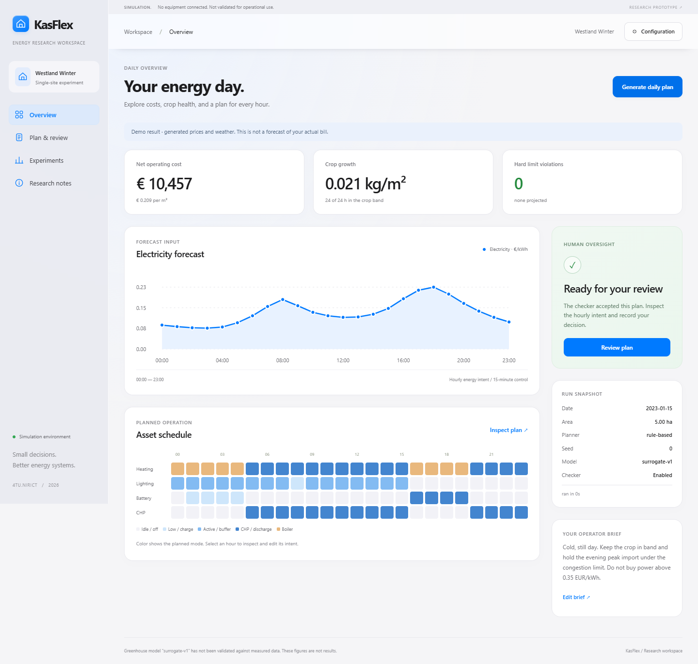

# KasFlex

[](https://github.com/Youw98/KasFlex/actions/workflows/ci.yml)
[](https://github.com/Youw98/KasFlex/releases)
[](https://www.python.org/)
[](LICENSE)


**AI-assisted greenhouse energy planning with an independent safety check and a human-in-the-loop.**

KasFlex creates a checked 24-hour greenhouse energy plan and then **negotiates it
with the grower dimension by dimension**: money, crop protection, grid impact and
practical fit. A disagreement gets a specific alternative rather than a silent
whole-plan regeneration.

> **Simulation only — alpha research software.** The demo can use real historical
> Dutch electricity prices and weather. Greenhouse climate, heat demand, crop
> response, and asset behavior are simulated and **not validated for operational use**.

[**Download the latest release**](https://github.com/Youw98/KasFlex/releases/latest)
· [Usage guide](docs/USAGE.md)
· [Architecture](docs/ARCHITECTURE.md)
· [Data & provenance](docs/DATA.md)
· [Parameters](docs/PARAMETERS.md)
· [Validation](docs/VALIDATION.md)
· [Grower usability test](docs/USABILITY_TEST.md)
· [MCP integration](docs/MCP.md)

---

## Try the team demo

1. Download the file for your operating system from
   [Releases](https://github.com/Youw98/KasFlex/releases).
2. Start KasFlex. The browser opens the new daily-planning workspace.
3. KasFlex opens in **Showcase (offline)** mode by default: a fixed, deterministic
   winter day that needs no network connection and is clearly labelled as showcase
   data. For a data-provenance demonstration, switch **Demo data** to
   **Real historical**; KasFlex then prepares a cached/downloaded Dutch
   market/weather day.
4. Choose what matters to the grower: **Balanced**, **Lowest cost**,
   **Crop first**, or **Grid relief**, plus battery reserve and operating
   preferences.
5. Keep the **independent safety check** on for the real grower decision. Switch it
   off only to demonstrate which hard violations the checker prevents.
6. Use **Show what the check prevents** for a clearly labelled safety demonstration
   on the same day. It compares a constraint-blind baseline with and without
   independent verification, including hard breaches, cost and tomato growth. This
   demonstration is separate from the grower's actual plan.
7. Click **Build tomorrow's plan**.
8. Respond separately to **saves money**, **protects the crop**, **respects the
   grid**, and **fits how I work**.
9. Disagree with one dimension to see KasFlex produce a targeted alternative and
   the trade-off. Approval unlocks only after all four dimensions have been reviewed
   and the current revision passes the checker.

The default showcase is intentionally synthetic and deterministic so a team
presentation cannot fail because of Wi-Fi or an external API. It is labelled as
showcase data in the interface. The **Real historical** option keeps the stricter
research behaviour: prepared input data is cached with provenance and checksums,
and missing real data is never silently replaced. A separate badge reports the
greenhouse-model validation state.

The first measured replay is now published over twelve deterministic AGC2 Reference
days. It is useful because it fails honestly: electricity accounting has 11.4%
mean absolute relative error, but heat has 389.0% and CO₂ 78.0%. The present
parameterisation is therefore **not calibrated for operational use**. See the
[full per-day validation table](docs/VALIDATION.md).

| Platform | Release file |
|---|---|
| Windows | `KasFlex-windows.exe` |
| macOS | `KasFlex-macos` |
| Linux | `KasFlex-linux` |

On macOS/Linux, make the downloaded file executable once with
`chmod +x <filename>`.

### Run from source instead

```bash
git clone https://github.com/Youw98/KasFlex.git
cd KasFlex
python3 -m venv .venv
source .venv/bin/activate
pip install -e ".[dev]"
kasflex ui
```

Windows PowerShell:

```powershell
git clone https://github.com/Youw98/KasFlex.git
cd KasFlex
python -m venv .venv
.venv\Scripts\Activate.ps1
pip install -e ".[dev]"
kasflex ui
```

---

## What KasFlex does

```text
real/synthetic inputs
        │
        ▼
 grower priorities + limits
        │
        ▼
 collaborative planner
        │
        ▼
 proposed 24h plan
        │
        ▼
 deterministic checker
        │
        ▼
 dimension-level negotiation
        │
        ▼
 targeted alternative / keep plan
        │
        ▼
 re-check + final plan
        │
        ▼
 simulated outcome
```

In practice:

- the grower chooses the day's priority and operating preferences;
- the collaborative planner proposes when to use lighting, battery, CHP, boiler,
  heat storage, and other flexible assets;
- a deterministic checker independently verifies limits;
- the grower responds separately on money, crop, grid and practical fit;
- a disagreement produces a specific alternative with a visible trade-off;
- every changed plan is checked again before it can become the final plan;
- the run records provenance, model identity, timing and deliberation data when
  research consent allows it.

The planner does **not** get to redefine the constraints that judge its own plan.

---

## What is real and what is simulated?

This distinction is central to KasFlex.

| Layer | Current status |
|---|---|
| Dutch day-ahead electricity price | **Real data supported** |
| Weather forecast | **Real data supported** |
| Realised weather | **Real data supported separately** |
| Human approve/reject/edit decision | **Observed directly** |
| Battery / CHP / boiler / buffer dispatch | Simulated |
| Greenhouse temperature / RH / CO₂ | Simulated |
| Heat demand | Simulated |
| Crop response / growth | Simulated |

Using real inputs does **not** make a simulated greenhouse result a measured result.

---

## Why this project exists

Dutch greenhouses can contain exactly the kinds of flexible assets that are useful
during grid congestion: CHP, batteries, heat buffers, controllable lighting, boilers,
and sometimes PV.

The interesting question is not only:

> Can an AI find a cheaper or more flexible schedule?

It is also:

> Can that schedule be checked independently, explained to a person, changed by that
> person, and still remain inside the constraints?

KasFlex is a research testbed for that second question.

---

## Demo mode vs research-data mode

### Team demo

The main workspace prepares a real historical Dutch day automatically. It uses a
public convenience mirror of ENTSO-E-derived Dutch day-ahead prices plus Open-Meteo
historical forecast data.

Before making a plan, the interface shows the actual input story: cheap/expensive
hours, temperature range, daylight and grid limits. Grower priorities then become
structured planner policy rather than decorative UI settings.

The prepared demo day is cached with source metadata and checksums. Reopening the
demo reuses the cached data instead of downloading it again.

If KasFlex cannot find a cached demo and cannot reach the data source, it stops. It
does **not** quietly replace real inputs with synthetic ones.

### Direct ENTSO-E workflow

For a research run, use the direct ENTSO-E pipeline:

```bash
export ENTSOE_API_KEY=...

kasflex fetch --date 2026-09-21
kasflex run --data-source cache --date 2026-09-21
```

The fetch date and run date must match.

After the fetch completes, the run itself is cache-only and can be replayed offline.

### Synthetic mode

Synthetic data still exists intentionally for:

- deterministic tests;
- controlled experiments;
- reproducing scenarios without network dependencies.

It is not what the normal team-demo workspace uses.

---

## Safety and human oversight

KasFlex separates planning from checking.

The checker can verify constraints such as:

- grid import/export limits;
- congestion-window limits;
- battery state and power bounds;
- CHP behavior;
- projected greenhouse/crop envelopes.

A human can then approve, reject, or edit the plan.

If a person edits an interval, the old verdict is invalidated and the plan must be
checked again before approval.

If the checker is disabled, KasFlex reports **not verified** rather than pretending
the plan was accepted.

---

## Two interfaces

### Grower UI — `/`

The default interface focuses on the decision:

- What is KasFlex proposing?
- Why?
- What changes compared with normal operation?
- What is the expected cost effect?
- Are the constraints satisfied?
- Do I agree?

The grower can compare verification on/off before making a plan and can object to
money, crop, grid or practical fit separately without discarding accepted parts.
Position and grid exposure have their own full screen, with contracted volume,
planned use, deviation, settlement and the short/long direction for every hour.

### Research UI — `/advanced`

The advanced interface exposes:

- all 24 hourly intervals;
- planner output;
- checker details and violations;
- data provenance;
- configuration;
- metrics;
- human edits;
- audit information.



_The advanced research workspace exposes the full schedule and audit context. The
default `/` route is the compact grower decision workflow described above._

---

## Architecture

KasFlex keeps external models and verification logic behind explicit interfaces.


At a high level:

```text
data acquisition ──► cache/provenance
                         │
                         ▼
                     planner
                         │
                         ▼
                  structured intent
                         │
              ┌──────────┴──────────┐
              ▼                     ▼
        safety checker       greenhouse model
              │                     │
              └──────────┬──────────┘
                         ▼
                    human review
                         │
                         ▼
                 audit / experiment
```

More detail: [docs/ARCHITECTURE.md](docs/ARCHITECTURE.md).

---

## Greenhouse model

KasFlex currently supports two greenhouse paths.

### Surrogate model

Fast, deterministic, and dependency-light.

It is useful for application development and experiment plumbing, but it is **not a
scientifically validated greenhouse model**.

### GreenLight-Gym2

GreenLight-Gym2 runs in a separate worker environment because its dependency and
licensing surface is deliberately isolated from the KasFlex core.

```bash
python3 -m venv .venv-greenlight
./.venv-greenlight/bin/pip install -r workers/greenlight/requirements.txt
kasflex run --greenhouse greenlight
```

Its use does not automatically make the KasFlex scenario validated against measured
greenhouse operation.

---

## Validation

KasFlex contains a measured-data validation workflow based on the Autonomous
Greenhouse Challenge dataset.

```bash
kasflex validate
```

The validation target is the measured research compartment, **not** the 5 ha
commercial scenario.

See [docs/VALIDATION.md](docs/VALIDATION.md) for the current validation status and
dataset instructions.

The measured replay is complete, but the present calibration did not pass an
operational threshold. Model-derived greenhouse performance numbers must therefore
still be treated as **apparatus, not findings**.

---

## Planners

| Planner | Role |
|---|---|
| `collaborative` | current-day optimisation driven by explicit grower priorities |
| `rule-based` | conventional baseline |
| `learned` | demand forecast + schedule optimisation |
| `naive` | deliberately simple comparison |
| `llm` | language-model planner |
| `mpc` | extension point |

Examples:

```bash
kasflex run --planner rule-based
kasflex run --planner learned
kasflex experiment --days 3
```

The conversational AI layer is optional. Planning, checking, and human review can
operate without an LLM.

---

## Common commands

```bash
# Open the browser UI
kasflex ui

# Check the installation and optional components
kasflex doctor

# Run the default reproducible scenario
kasflex run

# Fetch a real-data day
kasflex fetch --date 2026-09-21

# Run that cached day
kasflex run --data-source cache --date 2026-09-21

# Compare experiment conditions
kasflex experiment --days 3

# Optional agent-framework integration
pip install -e ".[mcp]"
kasflex mcp

# Validate against measured greenhouse data
kasflex validate

# Show registered datasets and provenance
kasflex datasets
```

For the full workflow, see [docs/USAGE.md](docs/USAGE.md).

---

## Data provenance

Downloaded series are stored under `data/cache/` with provenance and checksums.

```text
data/cache/
├── entsoe_da_YYYY-MM-DD.*
├── weather_forecast_YYYY-MM-DD_LAT_LON.*
├── weather_actual_YYYY-MM-DD_LAT_LON.*
└── MANIFEST.json
```

KasFlex keeps forecast weather and realised weather separate on purpose. A planner
must not receive future observations during planning.

See [docs/DATA.md](docs/DATA.md) and
[docs/PROVENANCE.md](docs/PROVENANCE.md).

---

## Research safeguards

KasFlex intentionally fails loudly rather than taking convenient shortcuts:

- missing real data does not silently become synthetic data;
- forecast and realised weather are separate;
- cached data are checksum-verified;
- clock-change days are refused instead of being squeezed into an incorrect
  24-hour representation;
- edited plans must be re-verified;
- checker-disabled plans are labelled **not verified**;
- measured replay and operational calibration are reported separately; a completed
  comparison never silently becomes an operational approval.

---

## Repository layout

```text
configs/                 reproducible scenarios
data/cache/              downloaded, checksummed input series
docs/                    architecture, data, validation, usage
src/kasflex/
├── adapters/            greenhouse and grid seams
├── checker/             deterministic verification
├── controllers/         planners
├── data/                acquisition, cache, provenance
├── energy/              assets and dispatch
├── forecast/            forecasting
└── ui/                  grower + research interfaces
workers/greenlight/      isolated GreenLight-Gym2 worker
tests/                   offline test suite
```

### Documentation

| Document | Purpose |
|---|---|
| [Usage](docs/USAGE.md) | install and run KasFlex |
| [Guide](docs/GUIDE.md) | conceptual walkthrough |
| [Architecture](docs/ARCHITECTURE.md) | components and boundaries |
| [Data](docs/DATA.md) | datasets and acquisition |
| [Provenance](docs/PROVENANCE.md) | engineering provenance notes |
| [Parameters](docs/PARAMETERS.md) | every shipped parameter: source or explicit **ASSUMPTION** |
| [Validation](docs/VALIDATION.md) | measured-data validation status |
| [MCP](docs/MCP.md) | optional agent-agnostic integration surface |
| [Decisions](docs/DECISIONS.md) | architecture decision records |
| [FAIR](docs/FAIR.md) | research-data principles |

---

## Development

```bash
pip install -e ".[dev]"
pytest
python -m ruff check src/ tests/
```

Or use:

```bash
make test
make lint
```

The release workflow builds and smoke-tests native applications on Windows, macOS,
and Linux.

---

## License

KasFlex core is licensed under [Apache-2.0](LICENSE).

The isolated GreenLight integration has its own AGPL-compatible licensing surface.
Third-party datasets and services retain their own terms; see
[docs/DATA.md](docs/DATA.md).
