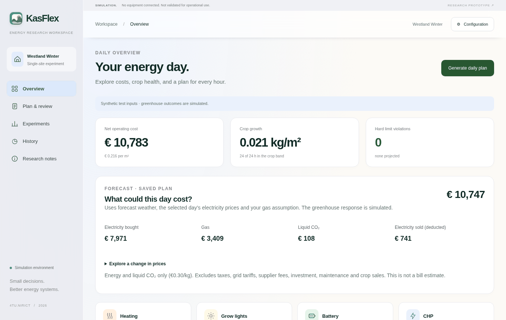
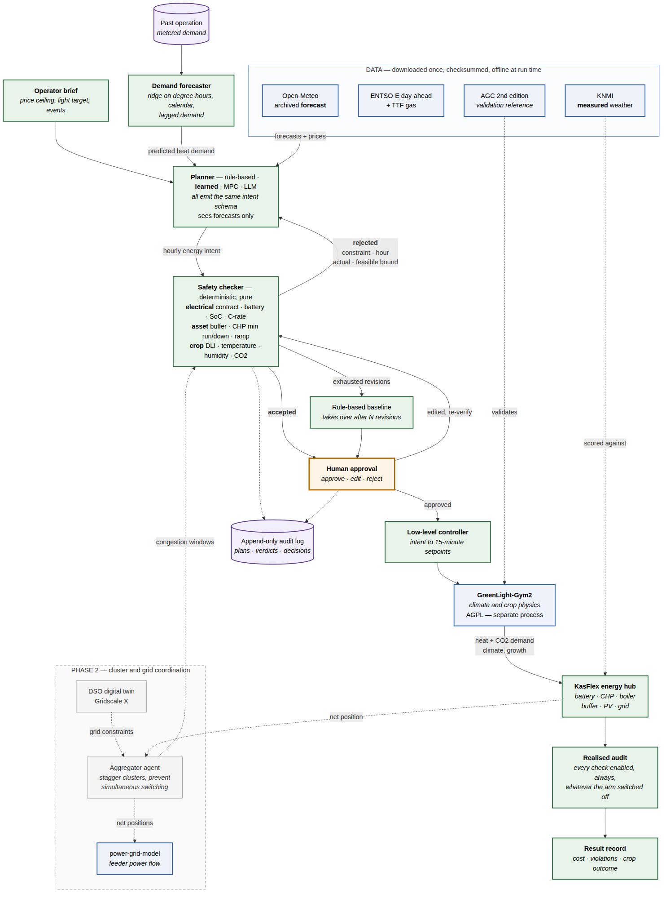

# KasFlex

[](https://github.com/Youw98/KasFlex/actions/workflows/ci.yml)
[](https://github.com/Youw98/KasFlex/releases)
[](https://www.python.org/)
[](LICENSE)


**AI-assisted greenhouse energy planning with an independent safety check and a human-in-the-loop.**

KasFlex creates a checked 24-hour greenhouse energy plan and then **negotiates it
with the grower dimension by dimension**: money, crop protection, grid impact and
practical fit. A disagreement gets a specific alternative rather than a silent
whole-plan regeneration.

> **Simulation only — alpha research software.** The demo can use real historical
> Dutch electricity prices and weather. Greenhouse climate, heat demand, crop
> response, and asset behavior are simulated and **not validated for operational use**.

[**Download the latest release**](https://github.com/Youw98/KasFlex/releases/latest)
· [Usage guide](docs/USAGE.md)
· [Architecture](docs/ARCHITECTURE.md)
· [Data & provenance](docs/DATA.md)
· [Parameters](docs/PARAMETERS.md)
· [Validation](docs/VALIDATION.md)
· [Calibration](docs/CALIBRATION.md)
· [Grower usability test](docs/USABILITY_TEST.md)
· [MCP integration](docs/MCP.md)

---

## Try the team demo

1. Download the file for your operating system from
   [Releases](https://github.com/Youw98/KasFlex/releases).
2. Start KasFlex. The browser opens the grower workspace at `/`.
3. KasFlex opens on a **workshop scenario**: a fixed day with a short story
   ("It's Monday morning in January…"), no network needed. Behind ⚙ (password),
   **Demo data** also offers **Showcase (offline)**, a fixed synthetic winter day,
   and **Real historical**, a cached or downloaded Dutch market and weather day.
4. **KasFlex goes first.** It plans tomorrow four ways (balanced, lowest cost,
   crop first, grid relief), compares them with normal control, and suggests one
   with its reasons in numbers. Click **Plan with this suggestion**, or **I choose
   differently** to set the priority, battery reserve and operating preferences
   yourself.
5. Optionally open **Your own targets and goals**: a maximum grid import (a hard
   limit the check enforces), heating temperatures for day and night (the heat the
   plan must deliver, so a warmer target costs more), a light target, a day budget,
   and up to five named goals such as "at most 6 equipment switches".
6. The plan appears as charts: price, grid import against the contract limit,
   battery and heat buffer, heat source, lamps and CHP, hour by hour (point at an
   hour for the details), plus a cost donut. The grid contract is a badge, not a
   question: a plan over the limit is never approved.
7. Respond to **saves money**, **protects the crop**, **fits how I work** (equipment
   switches, CHP hours and night hours, hours that differ from normal) and, if you
   set any, **meets my goals**. **Disagree** needs a short reason ("CHP maintenance
   8–14", "max 1.5 MW from 16 to 20", "we always have few staff"). KasFlex turns it
   into a plan change, shows the trade-off, and remembers it; a reason phrased as a
   rule comes back in later plans. A one-off reason ("only two staff tomorrow") is
   offered again with one click (↻) in the next suggestion, first when the day looks
   alike: the same weekday, a cold night again, or a lowered grid limit again.
8. **Why this plan?** shows which inputs the plan leans on (a what-if graph);
   **Week outlook** estimates a week of such days; in the chat version **Ask
   KasFlex** answers questions about the plan, with or without an AI model.
9. Approval unlocks once every part has your view and the plan passes the check.
   In a scenario, KasFlex then tells you how the day really went, and whether there
   was a trap.


_Step 1: the scenario story, tomorrow's prices, temperature and grid contract, and
KasFlex's suggestion compared with the other options and normal control._


_Step 2: the checked plan as charts, with the grower's view on money, crop, work and
own goals. A disagreement needs a reason; KasFlex adjusts the plan and remembers._

The default showcase is intentionally synthetic and deterministic so a team
presentation cannot fail because of Wi-Fi or an external API. It is labelled as
showcase data in the interface. The **Real historical** option keeps the stricter
research behaviour: prepared input data is cached with provenance and checksums,
and missing real data is never silently replaced. A separate badge reports the
greenhouse-model validation state.

The greenhouse model is now calibrated against measured AGC2 compartment data and
tested on 80 held-out days. Heat error fell from 93 to 22 kWh per day and CO₂ error
from 3.6 to 1.3 kg per day; heat is close in winter but still about three times too
high in April–May. The model is therefore still **not validated for operational
use**. See [validation](docs/VALIDATION.md) and [calibration](docs/CALIBRATION.md).

| Platform | Release file |
|---|---|
| Windows | `KasFlex-windows.exe` |
| macOS | `KasFlex-macos` |
| Linux | `KasFlex-linux` |

On macOS/Linux, make the downloaded file executable once with
`chmod +x <filename>`.

### Run from source instead

```bash
git clone https://github.com/Youw98/KasFlex.git
cd KasFlex
python3 -m venv .venv
source .venv/bin/activate
pip install -e ".[dev]"
kasflex ui
```

Windows PowerShell:

```powershell
git clone https://github.com/Youw98/KasFlex.git
cd KasFlex
python -m venv .venv
.venv\Scripts\Activate.ps1
pip install -e ".[dev]"
kasflex ui
```

---

## What KasFlex does

```text
real/synthetic inputs
        │
        ▼
 AI suggestion (4 options compared)
        │
        ▼
 grower priorities, targets, goals
        │
        ▼
 collaborative planner
        │
        ▼
 proposed 24h plan
        │
        ▼
 deterministic checker
        │
        ▼
 dimension-level negotiation (a reason is required to disagree)
        │
        ▼
 targeted alternative / keep plan  →  reason remembered
        │
        ▼
 re-check + final plan
        │
        ▼
 simulated outcome
```

In practice:

- KasFlex compares four ways to plan tomorrow and suggests one, with reasons;
- the grower accepts it or chooses the priority, targets and own goals;
- the collaborative planner proposes when to use lighting, battery, CHP, boiler,
  heat storage, and other flexible assets;
- a deterministic checker independently verifies limits, including the grid
  contract (firm, CBC, time-block, duration or non-firm) as an hourly hard limit;
- the grower responds separately on money, crop, practical fit and own goals;
- a disagreement needs a short reason, which KasFlex turns into a specific
  alternative with a visible trade-off and remembers for later plans;
- every changed plan is checked again before it can become the final plan;
- the run records provenance, model identity, timing and deliberation data when
  research consent allows it.

The planner does **not** get to redefine the constraints that judge its own plan.

---

## What is real and what is simulated?

This distinction is central to KasFlex.

| Layer | Current status |
|---|---|
| Dutch day-ahead electricity price | **Real data supported** |
| Weather forecast | **Real data supported** |
| Realised weather | **Real data supported separately** |
| Human approve/reject/edit decision | **Observed directly** |
| Battery / CHP / boiler / buffer dispatch | Simulated |
| Greenhouse temperature / RH / CO₂ | Simulated |
| Heat demand | Simulated |
| Crop response / growth | Simulated |

Using real inputs does **not** make a simulated greenhouse result a measured result.

---

## Why this project exists

Dutch greenhouses can contain exactly the kinds of flexible assets that are useful
during grid congestion: CHP, batteries, heat buffers, controllable lighting, boilers,
and sometimes PV.

The interesting question is not only:

> Can an AI find a cheaper or more flexible schedule?

It is also:

> Can that schedule be checked independently, explained to a person, changed by that
> person, and still remain inside the constraints?

KasFlex is a research testbed for that second question.

---

## Demo mode vs research-data mode

### Team demo

The grower workspace has two data modes, chosen with **Demo data** in the header:

| Mode | What it uses | Network |
|---|---|---|
| **Showcase (offline)**, the default | a fixed, deterministic winter day, labelled as showcase data | none |
| **Real historical** | a real Dutch day: day-ahead prices from a public mirror of ENTSO-E data, plus Open-Meteo historical forecast weather | Open-Meteo and GitHub, once |

Before making a plan, the interface shows the input story: cheap and expensive
hours, temperature range, daylight and grid limits. Grower priorities then become
structured planner policy rather than decorative UI settings.

A prepared real day is cached with source metadata and checksums. Reopening it
reuses the cache; **Refresh** downloads it again. If KasFlex has no cached day and
cannot reach the source, it stops with an error. It does **not** quietly replace
real inputs with synthetic ones.

### Direct ENTSO-E workflow

For a research run, fetch prices straight from ENTSO-E. This needs two things:

1. **An ENTSO-E token.** Register at
   [transparency.entsoe.eu](https://transparency.entsoe.eu/), then email
   transparency@entsoe.eu with the subject "Restful API access". Put the token in
   `.env` as `ENTSOE_API_KEY`, or save it under **Configuration → APIs** in `/advanced`.
   Keys stay on your computer and are never shown back.
2. **Network access** to `web-api.tp.entsoe.eu`, `api.open-meteo.com`,
   `historical-forecast-api.open-meteo.com` and `archive-api.open-meteo.com`.
   Sandboxes and company proxies often block these.

`kasflex doctor --network` checks both and names whatever is missing.

```bash
kasflex doctor --network
kasflex fetch --date 2026-09-21
kasflex run --data-source cache --date 2026-09-21
```

The fetch date and run date must match. After the fetch, the run is cache-only and
can be replayed offline. `kasflex daily` does fetch, plan and record in one step for
an unattended job.

### Synthetic mode

Synthetic data still exists intentionally for:

- deterministic tests;
- controlled experiments;
- reproducing scenarios without network dependencies.

It is not what the normal team-demo workspace uses.

---

## Safety and human oversight

KasFlex separates planning from checking.

The checker can verify constraints such as:

- grid import/export limits;
- congestion-window limits;
- battery state and power bounds;
- CHP behavior;
- projected greenhouse/crop envelopes.

A human can then approve, reject, or edit the plan.

If a person edits an interval, the old verdict is invalidated and the plan must be
checked again before approval.

If the checker is disabled, KasFlex reports **not verified** rather than pretending
the plan was accepted.

---

## Interfaces

`kasflex ui` serves five pages on `http://127.0.0.1:8765`, to this computer only.
For a workshop with tablets on the same network, start it with
`KASFLEX_ADMIN_PASSWORD=<your own> kasflex ui --host 0.0.0.0 --allow-network`;
KasFlex refuses a network address without both, because anyone on that network can
then use it.

### Grower workspace — `/`

The default page, shown above. It focuses on the decision:

- What does KasFlex suggest for tomorrow, and why (in numbers)?
- What does the plan do, hour by hour (charts, not a table)?
- Does it stay within the grid contract and my own limits?
- Do I agree, part by part, and if not, why?

What the grower sees depends on the study version set on the admin page:

| Version | Suggestion first | Agree/disagree with reason | Why-this-plan graph | Chat |
|---|---|---|---|---|
| 1 · No advisor | – | – | – | – |
| 2 · AI suggests | ✓ | ✓ | ✓ | – |
| 3 · AI + chat | ✓ | ✓ | ✓ | ✓ |

In version 1 the grower sets priority and targets, and KasFlex calculates and checks
the plan without suggesting, arguing or explaining. All versions use the same
planner and checker (ADR-0015 in [DECISIONS.md](docs/DECISIONS.md)).

The chat uses the configured AI model (Claude, OpenAI, Gemini, a local Ollama model
or any OpenAI-compatible server). Without one, an offline assistant answers from the
plan's own numbers. Both draw on the documents added on the admin page and name
the document they used. The chat and the suggestion are labelled as AI (EU AI Act,
art. 50), and the chat says whether questions go to an outside AI service or stay
on this computer.

The charts follow one set of rules: price and temperature are drawn as small
multiples rather than on two y-axes; each piece of equipment keeps one colour,
from a palette validated for colour-vision deficiency, in every chart; and every
chart has a "Show as table" twin. Position and grid exposure have their own screen. A research
consent dialog decides whether interaction data is recorded; the demo works fully
without it.

### Settings — the ⚙ button

The cogwheel in the top bar opens the settings, behind a password (`admin99`
unless `KASFLEX_ADMIN_PASSWORD` is set). Inside:

- **AI**: service (Claude, OpenAI, Gemini, Ollama, any OpenAI-compatible server),
  model, server address, API key, and a **Test** button;
- **Data**: workshop scenario, showcase or real historical data, and the ENTSO-E key;
- **Site**: grid contract type, import and export limits, battery and CHP size, gas
  price and the value of a lower peak.

Saved settings apply to every session until changed. The same password guards the
workshop admin page, API keys, documents, clearing remembered reasons, and all
research data (exports, deliberations, other participants' reasons); the password
is checked on the server, not only in the page. A participant withdraws their own
consent with a key their browser received when they consented. See the audit in
[docs/audits/2026-10-01](docs/audits/2026-10-01/REPORT.md) and the review in
[docs/audits/2026-10-02](docs/audits/2026-10-02/REPORT.md). It stops a participant
from changing the set-up, not someone with access to the computer itself.

### Workshop admin — `/admin`

For the researcher running a workshop:

1. **Study version**: no advisor, AI suggests, or AI + chat.
2. **Scenario for participants**, and whether to lock it so participants cannot
   switch day or data. The server enforces the lock and the study version, not only
   the page.
3. **Scenarios**: four built in, two good and two with a deliberate error the
   planner cannot see (a grid operator's curtailment notice; a CHP maintenance
   visit). Edit, duplicate or create scenarios: the story and debrief in English and
   Dutch, 24 prices and temperatures, the grid contract type, installation changes,
   and the error (type, hours, limit). Edited built-ins can be reset.
4. **Documents for the chat**: load a Word (.docx), .txt or .md file, or paste
   text (for a PDF, copy its text). Large Word files with pictures work: the browser
   sends only the text part. The chat answers from the plan and these documents and names the one it
   used. KasFlex ships one itself: the Dutch grid contract types.
5. **Remembered reasons**: what participants said when they disagreed. Clear them
   between workshop groups. On a shared laptop, tick **keep each anonymous tab's
   reasons apart** so people without a participant id do not see each other's
   reasons. A participant id and withdrawal key are kept only for the open tab.

The admin page asks for the settings password before it shows anything.

### Research workspace — `/advanced`



| View | What it does |
|---|---|
| **Overview** | generate a daily plan; cost breakdown, crop growth, hard-limit violations, prices, weather, battery state and what each asset does |
| **Plan & review** | all 24 hourly intervals, editable; every edit must be re-verified before **Approve** or **Reject**; export as PDF or JSON |
| **Experiments** | compare rule-based, learned and naive planners on one scenario |
| **History** | earlier plans and decisions |
| **Research notes** | the boundaries of the simulation |

**Configuration** (top right) holds every adjustable setting: site location, prices
and contract, grid limits, battery, CHP, heat buffer, PV, crop light target, the
planner, the safety checker, grid relief's value per kW, and the **APIs** section
for the ENTSO-E key and the AI model key. AI models: Anthropic Claude, OpenAI,
Google Gemini, Ollama on your own computer, or any OpenAI-compatible server. The
AI layer only explains; planning and checking work without it.

### Study setup — `/setup`

For researchers running a study: participants, reliance measurement, experiment
condition, all settings, experiment batches, and exports (summary CSV, a JSON-LD
research bundle, and the disagreements CSV).

### Previous grower screen — `/legacy-grower`

The earlier grower interface, kept for comparison. Its onboarding sets the site
location from either a **street address** (looked up to coordinates) or **latitude
and longitude**, for remote greenhouses without an address.

---

## Architecture

KasFlex keeps external models and verification logic behind explicit interfaces.



At a high level:

```text
data acquisition ──► cache/provenance
                         │
                         ▼
                     planner
                         │
                         ▼
                  structured intent
                         │
              ┌──────────┴──────────┐
              ▼                     ▼
        safety checker       greenhouse model
              │                     │
              └──────────┬──────────┘
                         ▼
                    human review
                         │
                         ▼
                 audit / experiment
```

More detail: [docs/ARCHITECTURE.md](docs/ARCHITECTURE.md).

---

## Greenhouse model

KasFlex currently supports two greenhouse paths.

### Surrogate model

Fast, deterministic, and dependency-light.

It is useful for application development and experiment plumbing, but it is **not a
scientifically validated greenhouse model**.

### GreenLight-Gym2

GreenLight-Gym2 runs in a separate worker environment because its dependency and
licensing surface is deliberately isolated from the KasFlex core.

```bash
python3 -m venv .venv-greenlight
./.venv-greenlight/bin/pip install -r workers/greenlight/requirements.txt
kasflex run --greenhouse greenlight
```

Its use does not automatically make the KasFlex scenario validated against measured
greenhouse operation. The AGC2 calibration (lamp cooling, cover area, vent area,
leakage) applies to the measured-data replay, not to the 5 ha planning scenario.

---

## Validation

KasFlex contains a measured-data validation workflow based on the Autonomous
Greenhouse Challenge dataset.

```bash
kasflex prepare-agc2 --all-days --compartment AICU
kasflex validate --greenhouse greenlight
```

The validation target is a measured 96 m² research compartment, **not** the 5 ha
commercial scenario.

| Quantity, 80 held-out days | gl-gym defaults | Calibrated |
|---|---:|---:|
| Heat, mean error per day | 93.1 kWh | 21.6 kWh |
| CO₂, mean error per day | 3.59 kg | 1.31 kg |
| Lamp electricity, mean error per day | 6.7 kWh | 6.7 kWh |

Two of the original errors were in the comparison, not the model: AGC2's heat is
computed from pipe temperatures, not metered, and the LEDs were replayed at full
power. Both are fixed. The remaining gap is spring heat. See
[docs/VALIDATION.md](docs/VALIDATION.md) and [docs/CALIBRATION.md](docs/CALIBRATION.md).

The calibration has not passed an operational threshold. Model-derived greenhouse
performance numbers must therefore still be treated as **apparatus, not findings**.

---

## Planners

| Planner | Role |
|---|---|
| `collaborative` | current-day optimisation driven by explicit grower priorities |
| `rule-based` | conventional baseline |
| `learned` | demand forecast + schedule optimisation |
| `naive` | deliberately simple comparison |
| `llm` | language-model planner |
| `mpc` | extension point, not implemented |

Examples:

```bash
kasflex run --planner rule-based
kasflex run --planner learned
kasflex experiment --days 3
```

The conversational AI layer is optional. Planning, checking, and human review can
operate without an LLM.

---

## Common commands

```bash
# Open the browser UI (add --anonymous to keep operator identity out of the audit log)
kasflex ui

# Check the installation and optional components
kasflex doctor

# Also check what real mode needs: the ENTSO-E key and reachable price/weather hosts
kasflex doctor --network

# Run the default reproducible scenario
kasflex run

# Fetch a real-data day
kasflex fetch --date 2026-09-21

# Run that cached day
kasflex run --data-source cache --date 2026-09-21

# Unattended daily job: fetch, plan, record
kasflex daily

# Verify an existing plan file against the safety checker
kasflex verify --plan plan.json

# Compare experiment conditions
kasflex experiment --days 3

# Optional agent-framework integration
pip install -e ".[mcp]"
kasflex mcp

# Prepare measured AGC2 days (any compartment) and validate against them
kasflex prepare-agc2 --all-days --compartment AICU
kasflex validate --greenhouse greenlight

# Show registered datasets and provenance
kasflex datasets
```

For the full workflow, see [docs/USAGE.md](docs/USAGE.md).

---

## What is still open

| Topic | Status | What it needs |
|---|---|---|
| Greenhouse model accuracy | Calibrated; heat close in winter, about 3× too high in April–May; CO₂ and lamp electricity close | Fit on indoor temperature too and free the screen and cover radiation parameters; confirm on the Reference compartment from the official 4TU archive |
| Grid relief trade-off | Done: a lower peak is bought only when each kW costs less than `grid_peak_value_eur_per_kw` (default €3.57, Liander 2026 kWmax) | Set your own network operator's tariff |
| Real data | Works; `kasflex doctor --network` reports what is missing | An ENTSO-E token, and network access to ENTSO-E and Open-Meteo |
| MPC reference planner | Interface only | A mixed-integer formulation; see `src/kasflex/controllers/mpc.py` |
| Text on screen | Kept to what a chart, number or icon cannot say; the reasons in words sit behind "Why, in words" | – |
| Reasons in free text | Rules recognise maintenance hours, staff, frost, light, buffer, grid limits (Dutch and English); other text is kept but changes nothing | An AI model could read more, but its reading would need the same checker-backed effects |
| Week plan | Deliberately not: KasFlex plans one day ahead, the week outlook is an estimate (ADR-0013) | – |

---

## Data provenance

Downloaded series are stored under `data/cache/` with provenance and checksums.

```text
data/cache/
├── entsoe_da_YYYY-MM-DD.*
├── weather_forecast_YYYY-MM-DD_LAT_LON.*
├── weather_actual_YYYY-MM-DD_LAT_LON.*
└── MANIFEST.json
```

KasFlex keeps forecast weather and realised weather separate on purpose. A planner
must not receive future observations during planning.

See [docs/DATA.md](docs/DATA.md) and
[docs/PROVENANCE.md](docs/PROVENANCE.md).

---

## Research safeguards

KasFlex intentionally fails loudly rather than taking convenient shortcuts:

- missing real data does not silently become synthetic data;
- forecast and realised weather are separate;
- cached data are checksum-verified;
- clock-change days are refused instead of being squeezed into an incorrect
  24-hour representation;
- edited plans must be re-verified;
- checker-disabled plans are labelled **not verified**;
- measured replay and operational calibration are reported separately; a completed
  comparison never silently becomes an operational approval.

Found a security problem? Please report it privately, as described in
[SECURITY.md](SECURITY.md).

---

## Repository layout

```text
configs/                 reproducible scenarios
data/cache/              downloaded, checksummed input series
docs/                    architecture, data, validation, usage
src/kasflex/
├── adapters/            greenhouse and grid seams
├── checker/             deterministic verification
├── controllers/         planners
├── data/                acquisition, cache, provenance
├── energy/              assets and dispatch
├── forecast/            forecasting
└── ui/                  grower + research interfaces
workers/greenlight/      isolated GreenLight-Gym2 worker and calibration harness
tests/                   offline test suite
```

### Documentation

| Document | Purpose |
|---|---|
| [Usage](docs/USAGE.md) | install and run KasFlex |
| [Guide](docs/GUIDE.md) | conceptual walkthrough |
| [Architecture](docs/ARCHITECTURE.md) | components and boundaries |
| [Data](docs/DATA.md) | datasets and acquisition |
| [Provenance](docs/PROVENANCE.md) | engineering provenance notes |
| [Parameters](docs/PARAMETERS.md) | every shipped parameter: source or explicit **ASSUMPTION** |
| [Validation](docs/VALIDATION.md) | measured-data validation status |
| [Calibration](docs/CALIBRATION.md) | how the GreenLight parameters were fitted and tested |
| [MCP](docs/MCP.md) | optional agent-agnostic integration surface |
| [Decisions](docs/DECISIONS.md) | architecture decision records |
| [FAIR](docs/FAIR.md) | research-data principles |

---

## Development

```bash
pip install -e ".[dev]"
pytest
python -m ruff check src/ tests/
```

Or use:

```bash
make test
make lint
```

The release workflow builds and smoke-tests native applications on Windows, macOS,
and Linux.

---

## License

KasFlex core is licensed under [Apache-2.0](LICENSE).

The isolated GreenLight integration has its own AGPL-compatible licensing surface.
Third-party datasets and services retain their own terms; see
[docs/DATA.md](docs/DATA.md).
