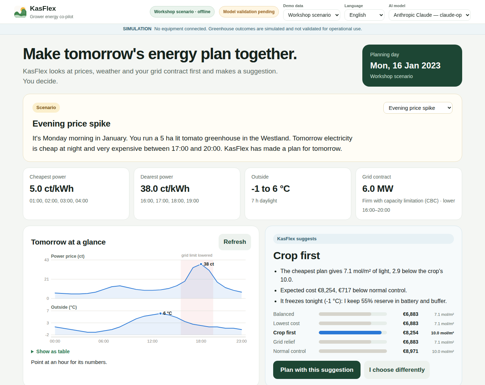
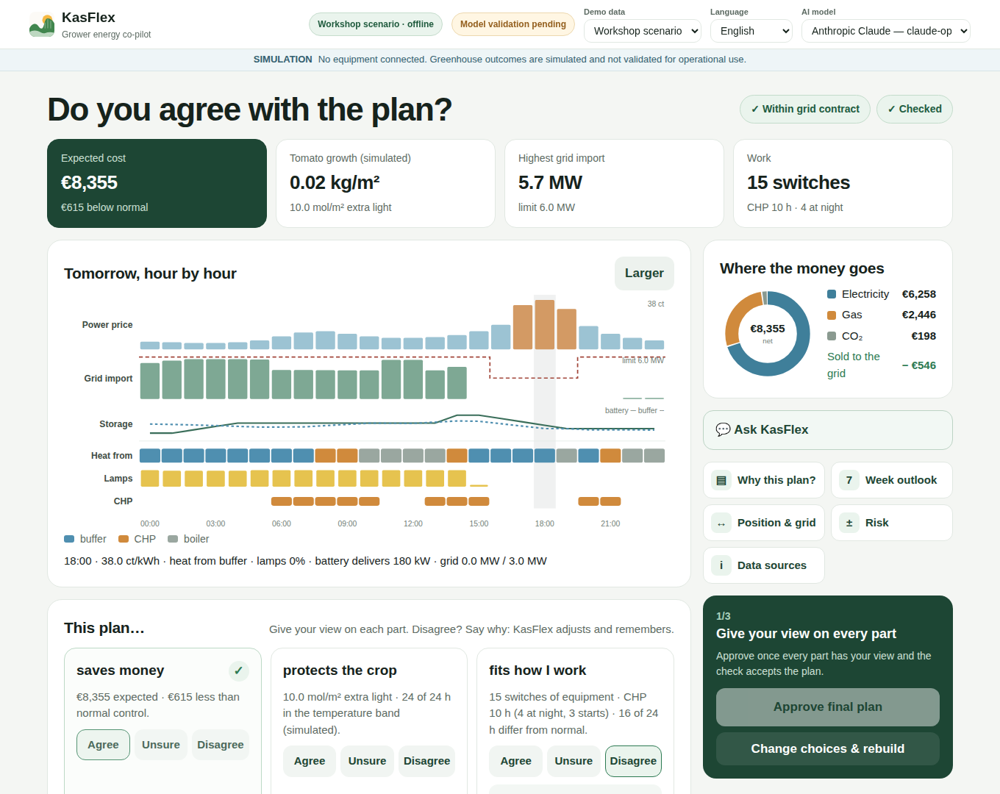

# KasFlex

[](https://github.com/Youw98/KasFlex/actions/workflows/ci.yml)
[](https://github.com/Youw98/KasFlex/releases)
[](https://www.python.org/)
[](LICENSE)


**AI-assisted greenhouse energy planning with an independent safety check and a human-in-the-loop.**

KasFlex makes a checked 24-hour energy plan for a Dutch greenhouse and then
**negotiates it with the grower part by part**: money, crop, grid and practical fit.
A disagreement needs a short reason, and KasFlex answers with a specific alternative
and remembers the reason for later plans. Nothing is approved until a person agrees
and a deterministic checker passes the plan. It is a research testbed for studying
how growers work with an AI advisor in workshops.

> **Simulation only — alpha research software.** KasFlex never switches equipment.
> It can use real historical Dutch electricity prices and weather, but greenhouse
> climate, heat demand, crop response and asset behaviour are simulated and **not
> validated for operational use**.



---

## Quick start

**Downloaded app.** Get `KasFlex-windows.exe`, `KasFlex-macos` or `KasFlex-linux`
from [Releases](https://github.com/Youw98/KasFlex/releases/latest). On macOS and
Linux, run `chmod +x <filename>` once. Start it and the browser opens the grower
workspace.

**From source** (Python 3.11 or later):

```bash
git clone https://github.com/Youw98/KasFlex.git
cd KasFlex
python3 -m venv .venv
source .venv/bin/activate          # Windows: .venv\Scripts\Activate.ps1
pip install -e ".[dev]"
kasflex doctor                     # checks the installation
kasflex ui                         # http://127.0.0.1:8765
```

No API key or network is needed for the default workshop scenarios.

### API keys

All optional. Save them under ⚙ → APIs, or put them in `.env` (copy
[.env.example](.env.example)). Details: [docs/API_SETUP.md](docs/API_SETUP.md).

| What for | Key | Where to get it |
|---|---|---|
| AI advice, chat and reading free-text reasons (one is enough) | `ANTHROPIC_API_KEY`, `OPENAI_API_KEY`, `GEMINI_API_KEY`, or `OPENAI_COMPATIBLE_API_KEY` with `OPENAI_COMPATIBLE_BASE_URL` | [Anthropic](https://console.anthropic.com/), [OpenAI](https://platform.openai.com/api-keys), [Google AI Studio](https://aistudio.google.com/app/apikey), or your own server |
| AI without an account or key | `OLLAMA_BASE_URL` (default `http://localhost:11434`) | [Ollama](https://ollama.com/) on your own machine |
| Real day-ahead electricity prices | `ENTSOE_API_KEY` | [ENTSO-E Transparency Platform](https://transparency.entsoe.eu/) account |
| Weather | none | Open-Meteo is public |

### A session in the grower workspace

1. KasFlex opens on a **workshop scenario**: a fixed day with a short story, offline.
2. **KasFlex goes first.** It plans tomorrow four ways (balanced, lowest cost, crop
   first, grid relief), compares them with normal control and suggests one with its
   reasons in numbers. The grower takes it, or chooses the priority, battery reserve,
   targets and own goals.
3. The plan appears as hour-by-hour charts (price, grid import against the contract,
   battery and heat buffer, heat source, lamps and CHP) and a cost donut. Every chart
   has a "Show as table" twin.
4. The grower answers **saves money**, **protects the crop**, **fits how I work** and,
   if set, **meets my goals**. **Disagree** needs a reason ("CHP maintenance 8–14",
   "max 1.5 MW from 16 to 20"); KasFlex turns it into a plan change and shows the
   trade-off.
5. Approval unlocks once every part has an answer and the plan passes the check. In a
   scenario, KasFlex then tells how the day really went, and whether there was a trap.



---

## Running a workshop

### Before a study with real participants

Work through the checklist at the top of
[docs/privacy/PARTICIPANT_INFORMATION.md](docs/privacy/PARTICIPANT_INFORMATION.md).
In short:

- [ ] **Set your own password.** Settings, the admin page and all research data sit
      behind one password. It is `admin99` unless `KASFLEX_ADMIN_PASSWORD` is set,
      and that default is public. Put your own in `.env` (see
      [.env.example](.env.example)).
- [ ] **Approve the information sheet.** The template (English and Dutch) is in
      `docs/privacy/`. Your institution fills in the brackets and approves it.
- [ ] **Cloud AI needs a data-processing agreement.** If the chat uses Claude,
      OpenAI or Gemini, arrange one with that provider. A local Ollama model needs
      none.
- [ ] **Make participant codes** on the admin page and tick **Only accept these
      codes**.

### The pages

`kasflex ui` serves these pages on `http://127.0.0.1:8765`, to this computer only.

| Page | For | What it does |
|---|---|---|
| `/` (also `/grower`) | the grower | the workspace above |
| ⚙ in the top bar | the researcher | **AI** (service, model, key, Test), **Data** (scenario, showcase or real historical day, ENTSO-E key), **Site** (grid contract, limits, battery, CHP, gas price) |
| `/admin` | the researcher | study version, scenarios, chat documents, remembered reasons, participant codes |
| `/advanced` (also `/research`) | the researcher | editable 24-hour plan, planner comparison, history, configuration and API keys |
| `/setup` | the researcher | participants, reliance measurement, experiment batches, exports (CSV, JSON-LD) |
| `/legacy-grower` | comparison only | the earlier grower screen |

Changing settings, the admin page, API keys, documents and all research data need
the password, and the server checks it, not only the page. Five wrong guesses pause that browser tab; all tabs together
are capped at 30 wrong guesses per 5 minutes.

### Study versions

Set on `/admin`. All three use the same planner and checker, so a study can compare
them on the same days (ADR-0015 in [docs/DECISIONS.md](docs/DECISIONS.md)).

| Version (`workshop.json`) | Suggestion first | Agree / disagree with a reason | "Why this plan?" graph | Chat |
|---|---|---|---|---|
| `manual` · No advisor | – | – | – | – |
| `ai` · AI suggests | ✓ | ✓ | ✓ | – |
| `collab` · AI + chat (default) | ✓ | ✓ | ✓ | ✓ |

The chat uses the AI model set under ⚙ (Claude, OpenAI, Gemini, Ollama or any
OpenAI-compatible server). Without one, an offline assistant answers from the plan's
own numbers. Answers and the suggestion are labelled as AI (EU AI Act art. 50), and
the chat says whether questions leave the computer.

### Scenarios

Four built-in scenarios, two good days and two with a deliberate error the planner
cannot see:

| Id | Title | Kind |
|---|---|---|
| `evening-peak` | Evening price spike | good |
| `spring-sun` | Sunny spring day | good |
| `grid-notice` | Grid operator notice (curtailment the planner is not told about) | flawed |
| `chp-maintenance` | CHP maintenance visit | flawed |

On `/admin` you can edit, duplicate or create scenarios (story and debrief in English
and Dutch, 24 prices and temperatures, grid contract, installation changes, the
error) and reset an edited built-in. **Lock the scenario** so participants cannot
switch day or data; the server enforces the lock and the study version. Built-ins are
defined in `src/kasflex/scenarios.py`; your edits are stored in `results/scenarios/`.

Under ⚙ → **Data** the grower page can also use **Showcase (offline)**, a fixed
synthetic winter day, or **Real historical**, a real Dutch day (prices from a public
ENTSO-E mirror, weather from Open-Meteo) that is downloaded once and cached.

### Between groups

On `/admin`, clear **Remembered reasons** so the next group starts fresh. On a shared
laptop, tick **keep each anonymous tab's reasons apart**. A participant's id and
withdrawal key live only in the open browser tab.

### Tablets on the same network

```bash
KASFLEX_ADMIN_PASSWORD=<your own> kasflex ui --host 0.0.0.0 --allow-network
```

KasFlex refuses a network address without both, because anyone on that network can
then reach it.

---

## Where data lives

Everything stays on the computer that runs KasFlex, under `KASFLEX_HOME` (default:
the current folder).

| Path | Contents |
|---|---|
| `.env` | API keys and the password (file mode 0600, git-ignored) |
| `results/` | private to the user (0700): consent, deliberations, remembered reasons, reviews, audit log, participant codes, workshop settings, edited scenarios, chat documents |
| `data/cache/` | downloaded prices and weather, with checksums in `MANIFEST.json` |

Research data is recorded only with the participant's consent. Withdrawing consent
erases it. Exports are on `/setup`.

---

## What is real and what is simulated

| Layer | Status |
|---|---|
| Dutch day-ahead electricity price | real data supported |
| Weather forecast and realised weather | real data supported, kept separate |
| The grower's approve, reject or edit decision | observed directly |
| Battery, CHP, boiler and buffer dispatch | simulated |
| Greenhouse temperature, humidity, CO₂ and heat demand | simulated |
| Crop response | simulated |

Using real inputs does not make a simulated greenhouse result a measured one.

The greenhouse model (GreenLight-Gym2, in an isolated worker) is calibrated on
measured AGC2 data from the official 4TU archive: fitted on one compartment, tested
on 80 held-out days and confirmed on a second compartment. On the held-out days heat
is off by about 14 kWh per day, CO₂ by 1.2 kg and indoor temperature by 1.4 K, and
heat is close from December to April, but May heat is still about 2.5 times too high. Model-derived greenhouse numbers are therefore
**apparatus, not findings**. See [docs/VALIDATION.md](docs/VALIDATION.md) and
[docs/CALIBRATION.md](docs/CALIBRATION.md).

### Safeguards

- The planner never defines the limits that judge its own plan; a separate checker
  enforces the grid contract and asset limits every hour.
- An edited plan must be checked again before approval. With the checker off, a plan
  is labelled **not verified**.
- Missing real data never silently becomes synthetic data, and clock-change days are
  refused rather than squeezed into 24 hours.
- Forecast and realised weather stay separate, so a planner never sees the future.

---

## Command line

```bash
kasflex ui                                   # the browser interface (--anonymous keeps operator identity out of the audit log)
kasflex doctor --network                     # also checks the ENTSO-E key and the price and weather hosts
kasflex fetch --date 2026-09-21              # download and cache a real day (needs ENTSOE_API_KEY)
kasflex run --data-source cache --date 2026-09-21
kasflex daily                                # unattended: fetch, plan, record (see deploy/)
kasflex verify --plan plan.json              # check a plan file
kasflex experiment --days 3                  # compare planners
kasflex validate --greenhouse greenlight     # compare the model with measured AGC2 data
kasflex datasets                             # data provenance registry
kasflex mcp                                  # optional MCP server (pip install -e ".[mcp]")
```

The full workflow, including the ENTSO-E token and the GreenLight worker, is in
[docs/USAGE.md](docs/USAGE.md).

---

## Maintaining KasFlex

### Day to day

```bash
make test          # pytest
make lint          # ruff
make test-browser  # the grower page in headless Chromium, with axe-core (not in CI)
make audit         # known vulnerabilities in the dependencies (not in CI)
```

CI runs ruff, a JavaScript syntax check and the test suite on Python 3.11 and 3.12,
plus separate jobs for the grid, MCP and GreenLight extras. Pushing a `v*` tag builds
and smoke-tests the Windows, macOS and Linux apps and publishes a release
([release.yml](.github/workflows/release.yml), [packaging/](packaging/README.md)).

### Read before changing anything

- [CONTRIBUTING.md](CONTRIBUTING.md): two rules that keep working when broken. Above
  all, **never import `gl_gym` in `src/kasflex/`**; it is AGPL-3.0 and would relicense
  the Apache-2.0 core. It runs as a subprocess worker.
- [docs/DECISIONS.md](docs/DECISIONS.md): the architecture decision records.
- [docs/ARCHITECTURE.md](docs/ARCHITECTURE.md): components and the module map (a test
  fails if the map drifts from the code).
- The README and docs are tested too: the simulation and "apparatus, not findings"
  notices must stay, and no document may state a test count.

### Where the code is

```text
src/kasflex/
├── ui/server.py         the API: planning, checking, data; serve()
├── ui/http.py           request handler: Host, Origin and password checks, routing
├── ui/deliberation_api.py, ui/research_api.py   negotiation and research endpoints
├── ui/workshop_api.py   admin page API: study version, scenarios, codes
├── ui/static/           plain HTML, CSS and JavaScript (no build step); demo.* is the grower page
├── checker/             deterministic plan checker
├── controllers/         planners (collaborative, rule-based, learned, naive, llm)
├── deliberation.py      part-by-part negotiation
├── reasons.py, memory.py   reading and remembering the grower's reasons
├── consent.py           research consent and withdrawal
├── scenarios.py         built-in workshop scenarios
├── workshop.py          study version and scenario lock
├── data/                price and weather acquisition, cache, provenance
└── adapters/            greenhouse model and grid seams
workers/greenlight/      isolated GreenLight-Gym2 worker (AGPL)
tests/                   offline test suite
```

### Security and privacy

- Report vulnerabilities as described in [SECURITY.md](SECURITY.md).
- Audits: [2026-10-01](docs/audits/2026-10-01/REPORT.md) and
  [2026-10-02](docs/audits/2026-10-02/REPORT.md). Neither left an open high or
  critical finding.
- Still open, outside the code: a data-processing agreement with any cloud AI
  provider, institutional approval of the information sheet, and whether the
  workshops fall under the AI Act research exemption (art. 2(6)).

### What is still open in the code

| Topic | Status |
|---|---|
| Greenhouse model accuracy | Calibrated on heat, CO₂ and indoor temperature, confirmed on the Reference compartment. May heat is still about 2.5× too high and Reference January about 45% too low (docs/CALIBRATION.md) |
| MPC reference planner | Interface only (`controllers/mpc.py`) |
| Free-text reasons | Rules recognise maintenance hours, staff, frost, light, buffer and grid limits (Dutch and English). With an AI model set, text the rules miss is read by the model, limited to the same effects, range-checked, labelled "KasFlex (AI)" and checked like any plan (`reasons.read_with_model`). Offline, such text is kept but changes nothing |
| Week plan | Deliberately not: one day ahead, the week view is an estimate (ADR-0013) |
| Parameter citations | [docs/PROVENANCE.md](docs/PROVENANCE.md) names the sources for battery, CHP, buffer and crop values, but the full references are not yet in the repository |

---

## Documentation

| Document | Purpose |
|---|---|
| [Usage](docs/USAGE.md) | install, run, real data, daily job, GreenLight, MCP |
| [Guide](docs/GUIDE.md) | how KasFlex works, in plain words and in depth |
| [Architecture](docs/ARCHITECTURE.md) | components, boundaries and module map |
| [Decisions](docs/DECISIONS.md) | architecture decision records |
| [Data](docs/DATA.md) · [Provenance](docs/PROVENANCE.md) | datasets, acquisition and sources |
| [Parameters](docs/PARAMETERS.md) | every shipped parameter, sourced or marked **ASSUMPTION** |
| [Validation](docs/VALIDATION.md) · [Calibration](docs/CALIBRATION.md) | measured-data validation and fitting |
| [Usability test](docs/USABILITY_TEST.md) | a ten-minute grower usability test |
| [Participant information](docs/privacy/PARTICIPANT_INFORMATION.md) | privacy checklist and information sheet template |
| [API setup](docs/API_SETUP.md) | ENTSO-E and Open-Meteo connections |
| [MVP plan](docs/MVP_PLAN.md) | requirements and status |
| [FAIR](docs/FAIR.md) · [WUR licence check](docs/WUR_LICENCE_CHECK.md) | research-data principles and licences |
| [MCP](docs/MCP.md) | optional agent integration |
| [docs/history/](docs/history/) | earlier design notes and roadmap, kept for reference |

## How to cite

Citation metadata is in [CITATION.cff](CITATION.cff) and [codemeta.json](codemeta.json);
GitHub's "Cite this repository" button uses it.

## License

KasFlex core is licensed under [Apache-2.0](LICENSE). The isolated GreenLight worker
runs GreenLight-Gym2, which is AGPL-3.0, in its own environment. Third-party datasets and services keep their
own terms; see [docs/DATA.md](docs/DATA.md).
